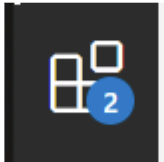
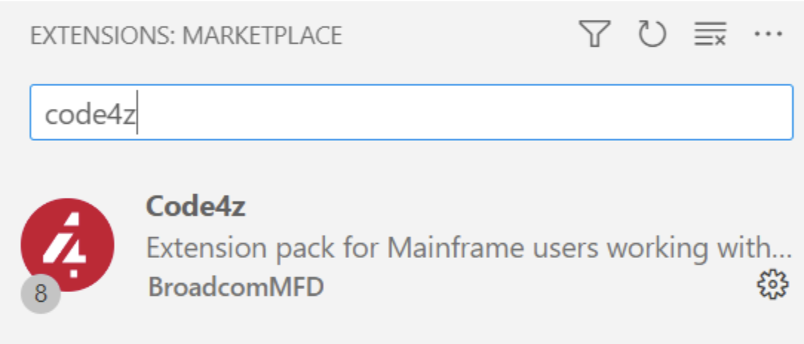
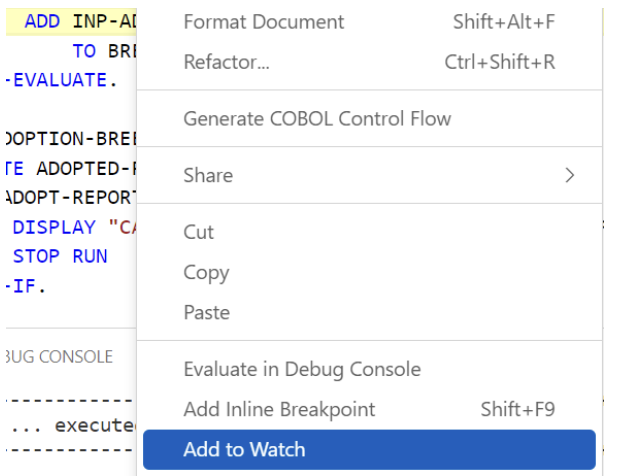

# Code/Build/Debug Challenge for GSE Netherlands 2023

# Main Scenario

## Getting Started


1. You are in the secure cloud environment which runs VS Code and is connected to the Mainframe
2. Install Code4z VSCode extension pack:
- Go to VS Code marketplace by clicking this icon  
- Search for Code4z and install 
- Return to your local files by clicking on the Explorer icon 

## Edit the DOGGOS application
Open the DOGGOS > COBOL > DOGGOS.CBL file
Add a new dog breed.
1. Copy block of code (lines 59-61)
2. Paste it after line 61

3. Change JINGO to another dog breed name (e. g. HUSKY) in the whole pasted block of code
4. For HUSKY-INDEX-VALUE change VALUE to 9
5. For OTHER-INDEX-VALUE change VALUE to 10
6. Change PIC 9(1) to PIC 9(2) for OTHER-INDEX-VALUE
7. Change OCCURS value in line 71 to 10

8. Copy block of code (lines 208-210)
9. Paste it after line 210
10. Change JINGO to the dog breed name you picked in step 3 (e. g.HUSKY) within the pasted block of code
11. Copy block of code (lines 139-143)
12. Paste it after line 143
13. Change JINGO to the dog breed name you picked in step 3 (e.g. HUSKY) within the pasted block of code
14. Remove extra spaces at the end of lines. See the code minimap to quickly find the locations.

## Build the DOGGOS application

1. Click on the hamburger menu (three lines) icon at the top of the sidebar
2. Select Terminal → New Terminal
3. Make sure the command line starts with: ```developer@ws-<"a-long-number-here">:~/doggos-gse```
4. Issue the following command to build and deploy the application to a data set: ```syncz -c "bldz"```
	(Click “Allow” if you see the pop-up window asking about copying and pasting permissions)


## Run the DOGGOS application AFTER the change is made and the the build is run

1. Go to Zowe Explorer (Z icon in the VS Code Activity Bar)
2. Hover the “zosmf” item in the DATA SET section in the sidebar and click on the magnifier icon.
3. Click on the CUST00X.PUBLIC.INPUT data set  to edit it
4. Add the following lines with the name of the dog breed you chose in the code change


5. Expand the CUST00X.PUBLIC.JCL data set and right click on the RUNDOG
6. Select “Submit JCL” menu item
7. Click on the JOB number in the pop up message in the right bottom corner to see the JOB output
8. Expand the “RUNDOG(JOBxxxxx)” and click on the RUNPGM:OUTREP item to browse the program output

The new dog breed “HUSKY” is listed and the counter reports 11 adopted HUSKY dogs.

## Debug

1. Let’s introduce a bug in the program data 🙂 Go to the input file and change the breed from “JINGO” to “JINGA”.
2. Rerun the application repeating the steps in the previous section (“From point 22 “Submit JCL””)
3. Open the output file and see that report is wrong, it now contains 0 for JINGO and 5 for the OTHER

4. Let’s debug the program
5. Go to debugger extension by clicking the play icon with a bug
 
6. We already have the debugging session preconfigured for DOGGOS app, so you can click Run and Debug at the top left corner of your screen straight away:

7. You will be asked for your Mainframe password. It is the same as your  mainframe userID. Now the debugger will fetch the extended source and start the session.
8. Now where to put a breakpoint?
9. The report for JINGO breed was wrong, so let’s put a breakpoint where the value is updated. Let’s find the first place in the code by searching for JINGO with Ctrl+F (CMD+F on Mac).
10. We can see that processing for JINGO breed is handled by these variables:

11. Let’s find all instances where JINGO-BREED-NAME by right-clicking on it, selecting Peek> Peek references. Go through the referenced to find where the amount is updated. It will be here around line 238 in extended source:

12. Double click on the 238 line in the editor window to move there.
13. Now let’s add a breakpoint after this condition to see if we get there.
Click on the left area on line 239. The red dot will appear

14. The value for OTHER breeds was wrong in the repo. Let’s put there a breakpoint as well
That would be on line 245

15. We now have 2 breakpoints (you can see them in breakpoints section in the bottom left corner):

16. Now let’s continue the execution by clicking the play button on the left of the debug toolbar:

17. We can see that while looping through the breeds the debugger has skipped the breakpoint on line 239 and stopped at line 245

18. Let’s check the variables. Click on the INP-ADOPTED-AMOUNT, right click and “Add to watch”

19. Do the same for the INP-DOG-BREED variable on line 216 to understand which breed we are analyzing
20. You can see in your watch section the value of the variables (BTW, a quick way is just to hover over a variable name in your extended source and the value will pop up)

21. As you can see we have encountered a wrong breed name “JINGA”, which means that our input file is corrupted! We also never entered a section for the JINGO breed, which means we never actually encountered this breed while parsing.
22. Now we found our problem - wrong breed in the input file :)

# Side Scenarios

## Build COBOL source on your PC with just 4 lines of code!!

1. Navigate to the following folder: …………
2. Expand the src/ folder and you will see two COBOL source files, which we will build as a part of this scenario
3. Locate the BUILDZ.js file in the /root and double click to edit it
4. Uncomment the first two lines, that initialize the compile and binder variables.
5. Uncomment the third line to compile the source code in the /src folder which creates an object module (syncz.yml file automatically downloads the object modules to the /build-out folder
6. Run the ```syncz -a “src::bldz``` command to run the compilation enabled by uncommenting the line in the previous step
7. Uncomment the fourth line to bind the object modules created in the previous steps, which automatically creates a load module and downloads it to the /build-out folder
8. Run the ```“syncz -a “src::bldz”``` command to run the bind enabled by uncommenting the line in the previous step

## Automation with Zowe

### GSE NodeJS

This project demonstrates how to build and test a primitive Node.js server and then deploy and run it on the mainframe using Zowe CLI. 
To use this scenario switch to ```gse-nodejs``` folder by clicking menu button in top left corner and picking “File” > “Open Folder…” > ```/home/developer/gse-nodejs``` You can continue with reading the same text in ```gse-nodejs/README.MD```

To open the terminal window use the menu in the top left corner > “Terminal” > “New Terminal”

#### Prerequisites

Before getting started, ensure you have the following prerequisites:

- Zowe CLI is installed and the profile is configured. This part should be done already, if not, we will need to manually [install Zowe CLI](https://docs.zowe.org/stable/user-guide/cli-installcli) and run ```scripts/configure-zowe-cli.sh <user-id>``` to configure the local profile.

- Node.js is installed on zDNT and is accessible in PATH, at the moment it is not included in the PATH, so we should create a basic ```.profile``` for the user by running ```scripts/configure-remote-profile.sh <your-user-id>```

#### Installation

This demo describes the automation case, so all the tasks could be done by running one command:
```bash
npm run start
```
Automation in detail is represented by a set of scripts under ```scripts/*```

For testing purposes or to try the Node JS server locally, use these commands:
```bash
npm install
npm run test
npm run start-dev
```


#### Deployment and Execution on Mainframe

After the server files are built locally the automation script packs server source code with dependencies to the server.tar and then sends it to the user's home directory on the mainframe using Zowe CLI. 

<details>
  <summary>Script</summary>

    #!/bin/bash

    echo ">>>>>> upload.sh: update server location in run script"
    sed "s|TARGET_DIR|$TARGET_DIR|g" "$LOCAL_DIR/scripts/templates/run-template.sh" > "$LOCAL_DIR/src/run.sh"

    echo ">>>>>> upload.sh: create a tar archive"
    tar -cf server.tar src node_modules public package.json package-lock.json

    echo ">>>>>> upload.sh: upload the archive to ${TARGET_DIR}/server.tar"
    zowe uss iss ssh "rm -r ${TARGET_DIR} 2>/dev/null"
    zowe uss iss ssh "mkdir ${TARGET_DIR}" 
    zowe files ul ftu -b "server.tar" "${TARGET_DIR}/server.tar"

    echo ">>>>>> upload.sh: extract and remove ${TARGET_DIR}/server.tar"
    zowe uss iss ssh "tar -xf server.tar 2>/dev/null" --cwd $TARGET_DIR
    zowe uss iss ssh "rm server.tar 2>/dev/null" --cwd $TARGET_DIR

    echo ">>>>>> upload.sh: update files permissions"
    zowe uss iss ssh "chown -R $USER_ID ./ 2>/dev/null" --cwd $TARGET_DIR
    zowe uss iss ssh "chtag -tRc ISO8859-1 ./ 2>/dev/null" --cwd $TARGET_DIR
    zowe uss iss ssh "chmod +x ./src/run.sh 2>/dev/null" --cwd $TARGET_DIR

</details><br>

As a result ```/u/users/<user-id>/server``` folder is created in USS.

Then we define a job to start the server, upload it to the dataset, submit, and wait for the output.

<details>
  <summary>Script</summary>

    echo ">>>>>> start-server.sh: create sequential data set for job"
    zowe zos-files create data-set-sequential $HLQ.NJSERVER
    sed "s|TARGET_DIR|$TARGET_DIR|g" "$LOCAL_DIR/scripts/templates/job-template.txt" > "$LOCAL_DIR/scripts/job.txt"

    echo ">>>>>> start-server.sh: upload job to the data set"
    zowe files upload file-to-data-set "$LOCAL_DIR/scripts/job.txt" "$HLQ.NJSERVER" 

    echo ">>>>>> start-server.sh: submit job to run the server"
    zowe jobs submit data-set "$HLQ.NJSERVER" --vasc > ./output.txt
    zowe files delete data-set "$HLQ.NJSERVER" -f

</details><br>

In this step, we create ```<user-id>.NJSERVER``` data set containing job to start the server and submit it. 
For the demo purposes server will run for 60 seconds and stop automatically, then delete the dataset.
While the server is running, we can check it is up by running the cURL command 
```curl --head 10.1.2.73:60111```


#### Conclusion

This demo scenario shows how to use a combination of NodeJS, bash, and Zowe CLI commands to provision the lifecycle of a simple Node JS server and can be used as a startup or reference point for creating a development pipeline. 

For more information on Zowe CLI and its capabilities, refer to the official Zowe documentation: [Zowe CLI Documentation](https://docs.zowe.org/stable/user-guide/cli-using-usingcli)

